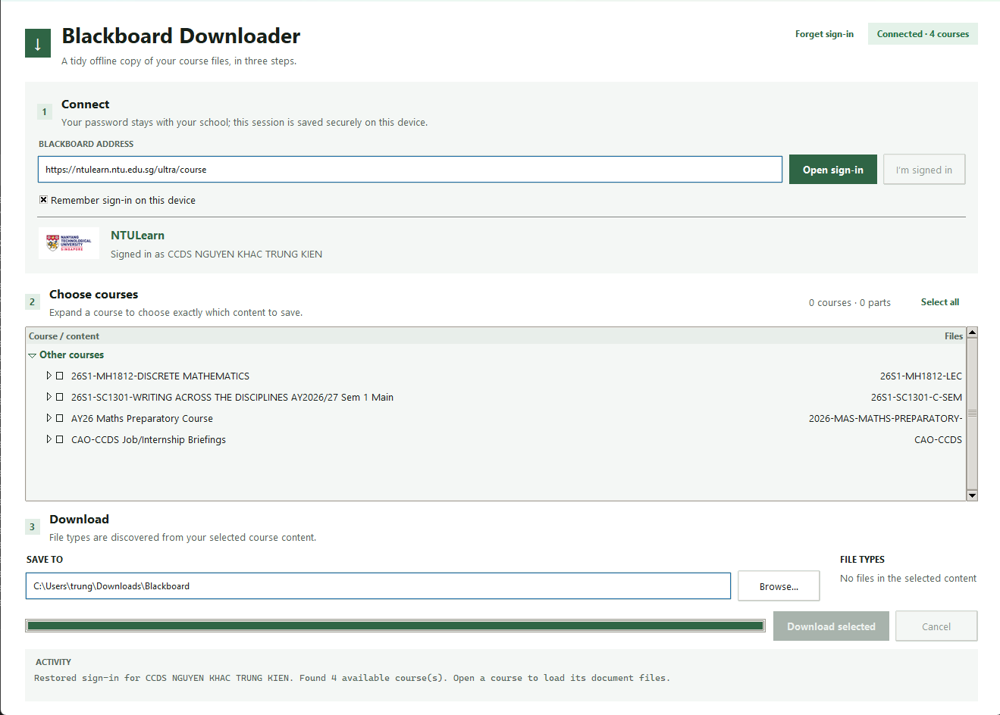

# Blackboard Downloader

A small cross-platform desktop app for saving an organized offline copy of your Blackboard Learn course files.




## Why this exists

Downloading an entire Blackboard course manually is slow and error-prone. Blackboard Downloader signs in through your school's real login page, discovers the files available to your account, and saves only the course sections and file types you choose.

It is designed for Blackboard Ultra installations that expose Blackboard's public REST API.

## Highlights

- Uses the school's normal browser-based sign-in flow, including SSO and MFA.
- Supports Chrome, Microsoft Edge, and Firefox through Selenium Manager.
- Restores sign-in securely across launches using the operating system credential vault.
- Shows the signed-in account and institution branding captured from Blackboard.
- Loads course content lazily when a course is opened instead of scanning everything at startup.
- Expands courses into a selectable content tree for partial-course downloads.
- Discovers file extensions dynamically from the selected content.
- Filters Blackboard navigation artifacts such as `.jsp`, `.html`, `.js`, and `.css`.
- Indexes courses and content items concurrently with a shared request limit.
- Downloads up to four files in parallel with file-level progress.
- Preserves useful course and content folders while removing duplicate filename directories.
- Skips existing files and safely removes incomplete `.part` files after cancellation.
- Tries alternate Blackboard URLs before marking stale files unavailable.
- Handles Windows path-length constraints and safely migrates the older `file.ext/file.ext` layout.

## Requirements

- Python 3.10 or newer
- Windows 10/11, macOS, or a Linux desktop
- Google Chrome, Microsoft Edge, or Mozilla Firefox
- A Blackboard account with access to the desired courses
- Linux only: a working Secret Service provider for secure session storage

## Download installers

Prebuilt packages are published on the [GitHub Releases page](https://github.com/KNN-07/Blackboard-Downloader/releases):

- Windows x64 setup installer and portable `.exe`
- macOS Apple Silicon and Intel `.dmg` images
- Linux x64 Debian package and portable `.tar.gz`

The packages are currently unsigned. Windows SmartScreen and macOS Gatekeeper may therefore ask for confirmation before the first launch. Review the source and release workflow before bypassing an operating-system warning.

## Quick start

Clone the repository and enter the project directory:

```bash
git clone https://github.com/KNN-07/Blackboard-Downloader.git
cd Blackboard-Downloader
```

Create a virtual environment:

```bash
python -m venv .venv
```

Activate it on Windows PowerShell:

```powershell
.\.venv\Scripts\Activate.ps1
```

Or on macOS and Linux:

```bash
source .venv/bin/activate
```

Install the dependencies and start the app:

```bash
python -m pip install -r requirements.txt
python main.py
```

The app also audits its Python environment at startup and provides the exact installation command if a required package is missing.

## Usage

1. Enter your Blackboard address. A full Ultra URL or just the school hostname is accepted.
2. Choose whether the sign-in should be remembered on the device.
3. Select **Open sign-in**, finish signing in through the browser, then select **I'm signed in**.
4. Expand a course to load its content. Only courses you open or select are indexed.
5. Select entire courses or individual content branches.
6. Choose from the file extensions discovered in the selected content.
7. Select a destination and choose **Download selected**.

The progress bar tracks unique logical files after duplicates are combined. Downloaded, already-existing, and unavailable files each advance progress exactly once.

## Session security and privacy

Blackboard Downloader never asks for or stores your school password. Authentication happens in the school's own browser page.

When **Remember sign-in on this device** is enabled:

- Blackboard session cookies are encrypted before being written to application data.
- The encryption key is stored through `keyring` in Windows Credential Manager, macOS Keychain, or Linux Secret Service.
- Selecting **Forget sign-in** removes the saved session and its credential-vault key.

Disable the option to keep the session only for the current app run. Blackboard may expire a saved session at any time, in which case the app asks you to sign in again.

## How downloads are organized

Files are saved beneath the chosen destination using the useful parts of Blackboard's hierarchy:

```text
Blackboard/
└── Course name/
    └── Course Materials/
        └── Lecture Slides/
            └── Chapter 3 Slides.pdf
```

Content nodes that merely wrap one file are flattened, so the app does not create paths such as `Chapter 3 Slides.pdf/Chapter 3 Slides.pdf`. Repeated adjacent folder titles are collapsed, and long components receive a short stable hash to avoid collisions.

## Concurrency model

The app is intentionally bounded to avoid overwhelming a school's Blackboard server:

- Up to four courses can be indexed concurrently.
- Independent content items inside a course are scanned concurrently.
- Indexing is capped at eight Blackboard requests globally.
- Up to four unique files are downloaded concurrently.
- Indexing and downloading share the same global request ceiling.

## Blackboard compatibility

The app uses endpoints under Blackboard's public Learn REST API. Administrators can restrict these endpoints or individual content handlers. An inaccessible course remains visible and can be retried without blocking other courses.

HTTP 404 and 410 responses for catalogued files are treated as stale Blackboard entries. The app tries any alternate URL for the same logical file, then reports it as unavailable and continues with the rest of the batch.

## Project structure

```text
blackboard_gui/
├── app.py              # Tkinter interface and background task coordination
├── client.py           # Blackboard API traversal, filtering, and downloads
├── dependencies.py     # Runtime dependency audit
├── secure_store.py     # Encrypted cross-platform session persistence
└── branding_cache.py   # Institution name and logo cache
tests/                  # Unit and regression tests
main.py                 # Application entry point
requirements.txt        # Runtime dependencies
```

## Testing

Run the test suite from the repository root:

```bash
python -m unittest discover -s tests -v
```

The regression suite covers session storage, dependency auditing, Blackboard response handling, content-tree filtering, lazy and parallel indexing, parallel download progress, stale URLs, duplicate paths, and legacy path migration.

## Automated builds and releases

Every push and pull request to `main` runs the test suite on Windows, macOS, and Linux with Python 3.10 and 3.12.

The **Build installers** workflow supports two release paths:

- Run it manually from the GitHub Actions page to produce downloadable workflow artifacts retained for 14 days.
- Push a version tag to build every platform and publish the results as a GitHub Release:

```bash
git tag v0.1.0
git push origin v0.1.0
```

Version tags must begin with `v` and use a value such as `v0.1.0` or `v0.1.0-beta.1`.

The release matrix produces:

```text
Windows x64       Setup.exe + portable.exe
macOS arm64       DMG
macOS x86_64      DMG
Linux x86_64      DEB + portable tar.gz
```

## Building locally

Install PyInstaller and build on the operating system you want to target:

```bash
python -m pip install pyinstaller
pyinstaller --noconfirm --onefile --windowed --name "Blackboard Downloader" main.py
```

The executable is written to `dist/`. PyInstaller does not cross-compile, so Windows, macOS, and Linux builds must be produced on their respective platforms.

## Troubleshooting

### No browser opens

Update Chrome, Edge, or Firefox and confirm it can be launched normally. Selenium Manager automatically resolves a compatible browser driver.

### A saved sign-in cannot be restored

The Blackboard session may have expired, or the operating system credential vault may be unavailable. Sign in again, or disable **Remember sign-in on this device** for a one-time session.

### A course cannot be inspected

The institution may restrict the required REST endpoint or a Blackboard content handler may reject API access. Other courses remain usable.

### A file is unavailable

Blackboard sometimes leaves stale file references in course content. The app tries alternate references first, logs the unavailable file, and continues the batch.

### A destination path is too long

Choose a shorter download destination. The app already compacts generated path components, but it cannot shorten a deeply nested destination chosen outside the app.

## Contributing

Issues and focused pull requests are welcome. Please include the operating system, Python version, Blackboard interface type, reproducible steps, and relevant Activity output with personal information removed.

## Disclaimer

This is an unofficial community project and is not affiliated with or endorsed by Anthology Inc., Blackboard, Nanyang Technological University, or any other institution. Use it only with accounts and course materials you are authorized to access, and follow your institution's policies and applicable copyright rules.
